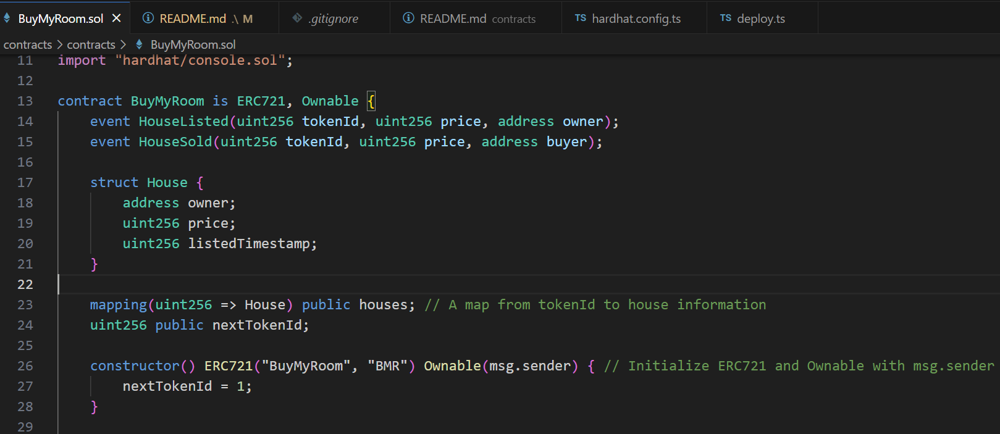
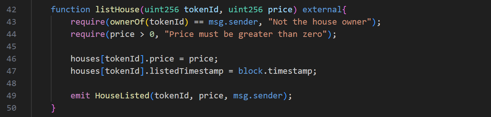
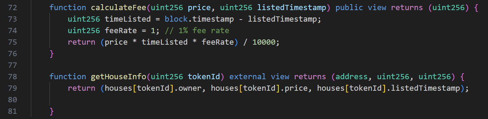
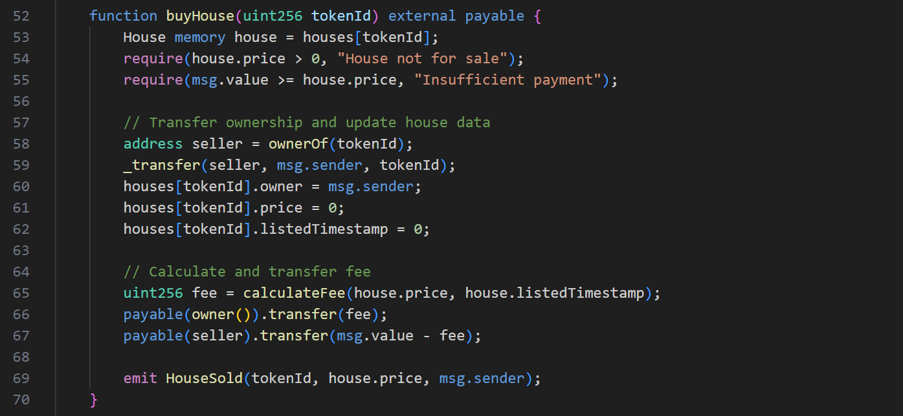
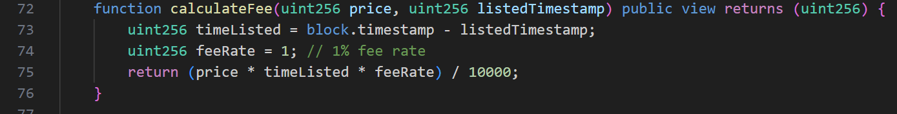
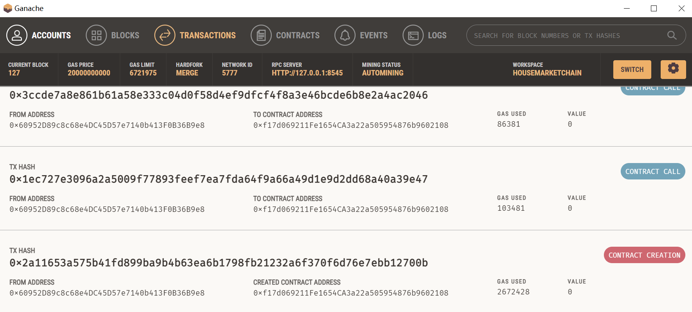
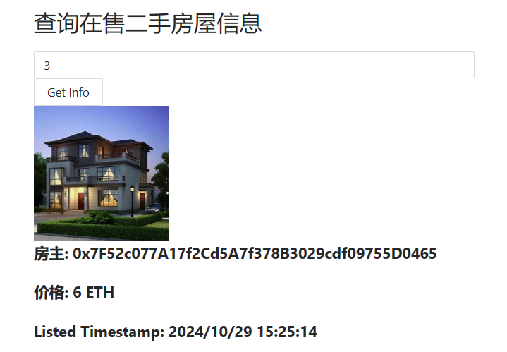
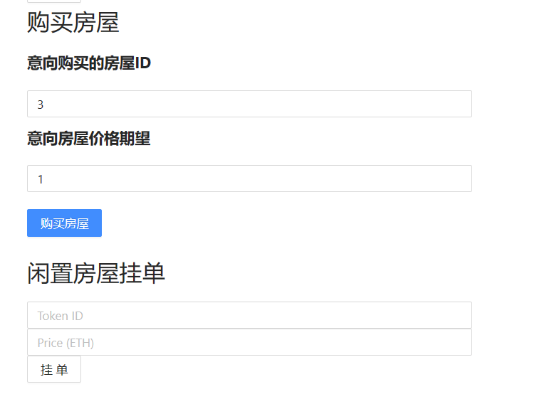
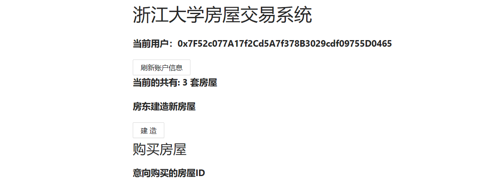
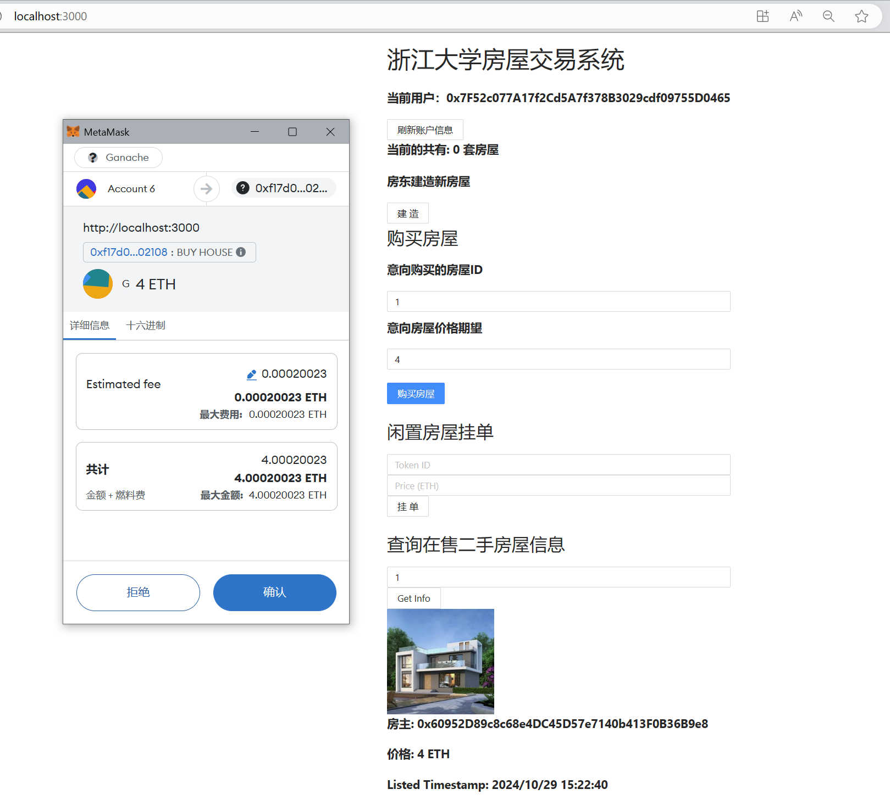

# 3210105952-艾子翔-作业2

课程作业2要求我们构建一个基于以太坊本地私有链的去中心化房产交易系统，助教提供了基于Hardhat的合约代码框架和基于React的前端代码，我主要实现了BuyMyRoom.sol的合约代码，还有自己搭建了一个前端用户界面，实现了作业要求的功能

## 运行指令

1. 在本地启动ganache应用，设置成运行在 `127.0.0.1:8545`
2. 在 `./contracts` 中安装需要的依赖，运行如下的命令：

   ```bash
   npm install
   ```
3. 在 `./contracts` 中编译合约，运行如下的命令：

   ```bash
   npx hardhat compile
   ```
4. 把编写的合约部署到Ganache区块链上，得到contraction对应的hash后复制到前端

   ```
   npx hardhat run scripts\deploy.ts --network ganache
   ```
5. 把生成的对应ABI文件复制到React前端文件夹

   ```
   contracts\artifacts\contracts\BuyMyRoom.sol\BuyMyRoom.json
   ```
6. 在 `./frontend` 中安装需要的依赖，运行如下的命令：

   ```bash
   npm install
   ```
7. 在 `./frontend` 中启动前端程序，运行如下的命令：

   ```bash
   npm run start
   ```

## 功能实现分析

### 1.房屋发行

我们把房屋当作NFT产品，通过继承ERC721合约，创建了HouseMarket合约，合约发起者作为房东，可以自己新建房产，然后挂单出售，其他用户可以查看所有房产的信息，能够购买房产，并且转卖二手房产



### 2.挂单出售

房子的所有者可以通过在合约上挂单，来出售房屋，首先判断用户是否是房产的拥有者，如果是就在合约的存储空间中更新房产信息，允许用户设定出售价格，并且记录挂单时间，以用于根据挂单时间长短后续计算手续费



### 3.查询房产信息

用户通过指定房产ID来查询对应的房产信息，通过访问contract在链上保存的数据实现，找到对应的主人和价格，挂单时常



### 4.购买房屋

用户查询到对应房产信息和价格后，如果房产在售，则可以通过支付ETH来购买房产，购买后房产主人便更新成为购买用户，并且把相应房产从挂单列表中移除，重新变成未在售状态



### 5.平台收取手续费

在购买房屋时，通过计算挂单时间和购买时间的差值计算挂单时常，在根据房产价格，以及1%的手续费比率。计算买方应该额外支付给平台的手续费，计算后在上面的购房时把这部分费用转交给owner，剩下的钱交给卖房者账户地址



## 项目运行截图

### 1.本地私有链上的合约记录



### 2.在售房产信息查询



### 3.房产挂单出售和购买功能



### 4.合约拥有者铸造新房产



### 5.和MetaMask钱包交互



## 参考内容

- 课程的参考Demo见：[DEMOs](https://github.com/LBruyne/blockchain-course-demos)。
- 快速实现 ERC721 和 ERC20：[模版](https://wizard.openzeppelin.com/#erc20)。记得安装相关依赖 ``"@openzeppelin/contracts": "^5.0.0"``。
- 如何实现ETH和ERC20的兑换？ [参考讲解](https://www.wtf.academy/en/docs/solidity-103/DEX/)
